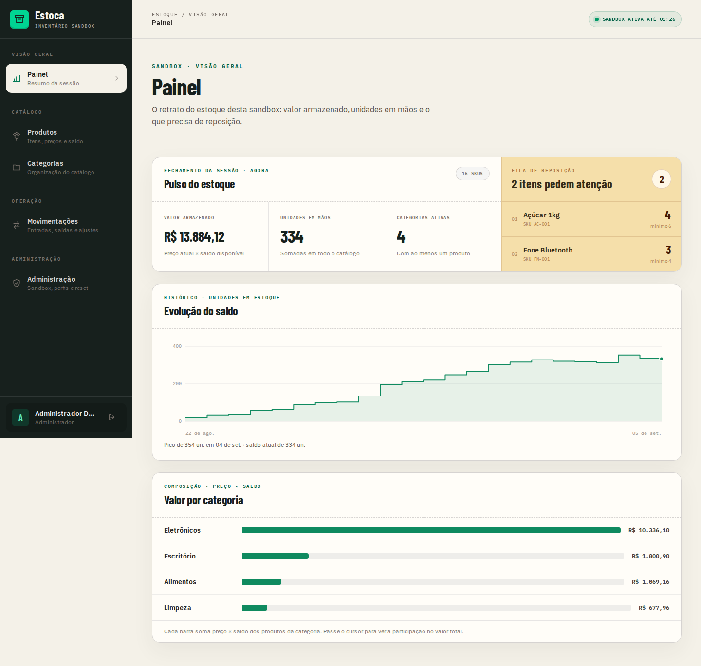
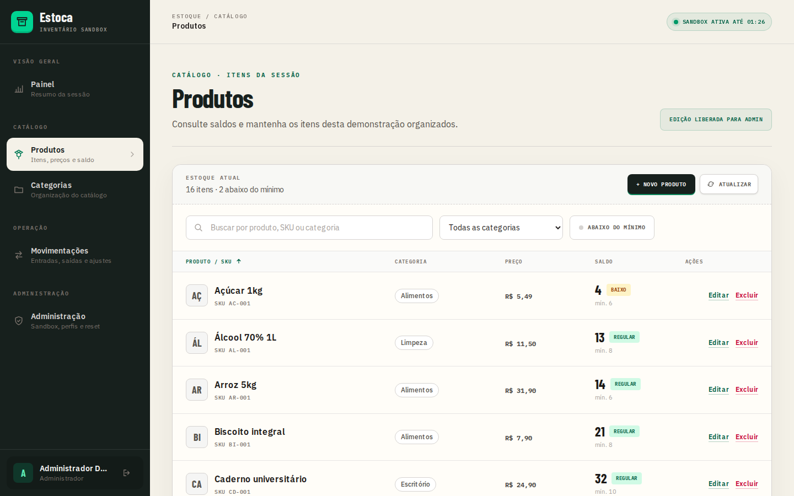
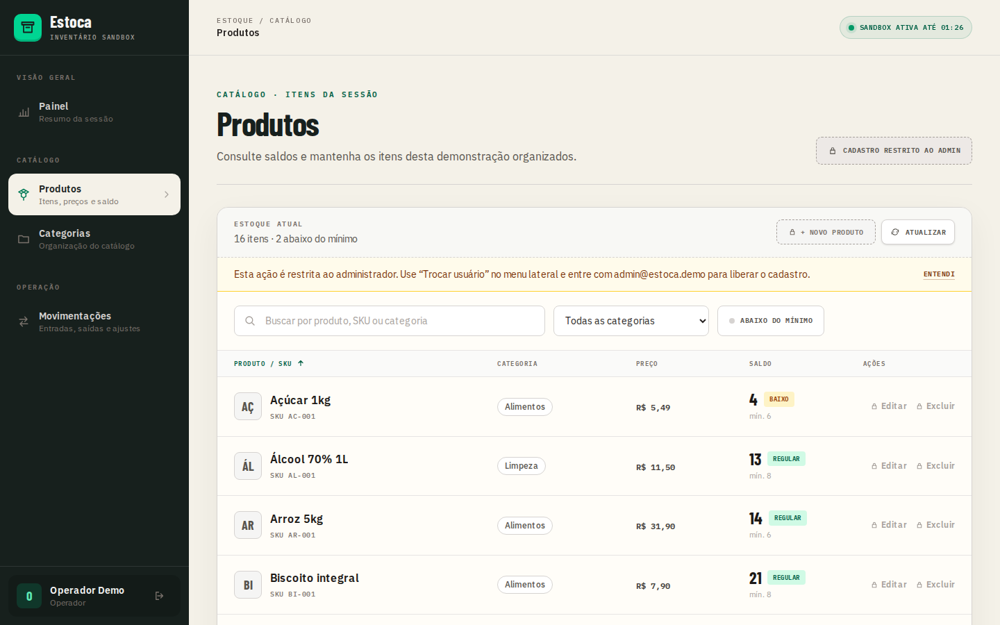
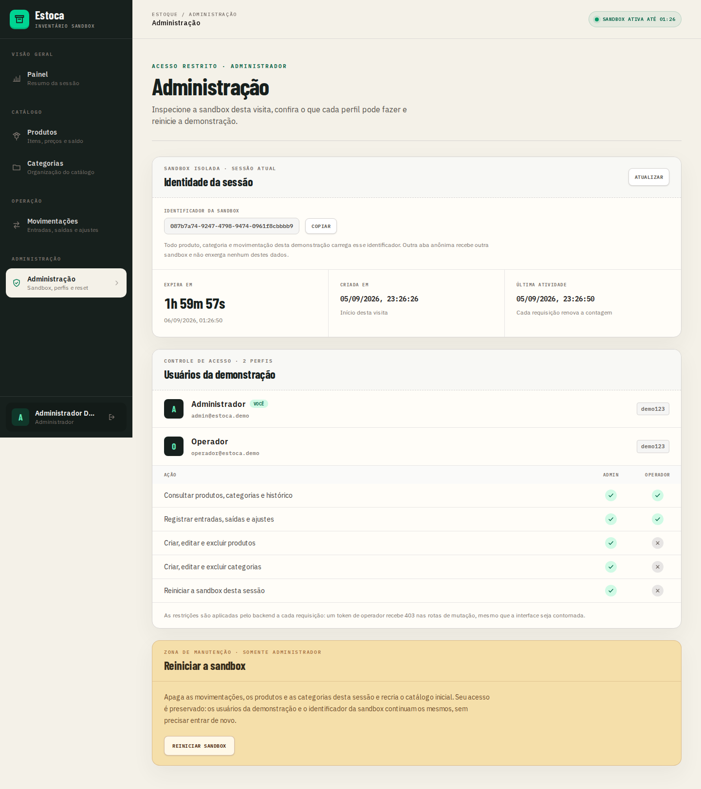

# Estoca

Mini ERP de estoque construído como projeto de portfólio. Cada visitante recebe
uma sandbox isolada para explorar produtos, categorias e movimentações sem ver
ou alterar dados de outra pessoa. Sessões expiram automaticamente e os dados
antigos são removidos por rotinas agendadas.

**Stack:** FastAPI · SQLAlchemy async · Alembic · PostgreSQL · Next.js ·
TypeScript · Docker

## Experimente em produção

- Frontend: https://estoca-erp.vercel.app
- API: https://estoca-api.onrender.com
- OpenAPI: https://estoca-api.onrender.com/docs
- Health check: https://estoca-api.onrender.com/healthz

O backend usa o plano gratuito do Render e pode levar cerca de um minuto para
responder à primeira requisição depois de um período sem tráfego.

As credenciais ficam preenchidas na interface:

| Perfil | Email | Senha | Acesso |
|---|---|---|---|
| Administrador | `admin@estoca.demo` | `demo123` | CRUD do catálogo e movimentações |
| Operador | `operador@estoca.demo` | `demo123` | Consulta e movimentações |

Cada nova sandbox já começa pronta para exploração, com 4 categorias, 16
produtos, saldos variados e 23 movimentações de exemplo. Há entradas, saídas,
um ajuste de inventário e produtos abaixo do estoque mínimo. O administrador
pode restaurar esse estado inicial usando o reset da sessão.

## Telas

O painel reúne o fechamento da sessão, a evolução do saldo ao longo do tempo e a
composição do valor por categoria. Os gráficos são desenhados em SVG e CSS, sem
biblioteca:



O catálogo tem ordenação por coluna, filtro por categoria e recorte de itens
abaixo do estoque mínimo:



O mesmo catálogo visto pelo operador. Os controles de cadastro continuam na
tela, marcados com cadeado, e o clique explica a restrição — o backend responde
403 mesmo que a interface seja contornada:



A área restrita mostra a identidade da sandbox, o que cada perfil pode fazer e o
reset da demonstração:



As doze capturas, incluindo formulários, ajuda contextual e a versão para
celular, estão em [`docs/screenshots/`](docs/screenshots/) e são geradas por
`npm run screenshots`.

## O que está pronto

- Sandbox isolada por visitante, com expiração e limpeza automática.
- Login com perfis de administrador e operador. O bloqueio fica visível na
  interface e é aplicado pelo backend a cada requisição.
- Painel com fechamento do estoque, evolução do saldo no tempo e valor por
  categoria.
- CRUD de produtos e categorias, com busca, ordenação por coluna e filtros por
  categoria e por estoque abaixo do mínimo.
- Entrada, saída e ajuste absoluto de estoque, com histórico paginado e filtros
  por produto, tipo de operação e período.
- Área de administração com identidade da sandbox, matriz de permissões por
  perfil e reset da sessão sem deslogar.
- Catálogo inicial realista com 16 produtos e 23 movimentações distribuídas ao
  longo de 14 dias.
- Bloqueio de saída sem saldo e atualização atômica do produto e do histórico.
- Interface responsiva validada em produção no Chrome e no WebKit em viewport
  de iPhone.

## Arquitetura

O monorepo separa a API em `backend/` e a aplicação web em `frontend/`:

```text
Navegador
  └─ sessionStorage + cookie/header X-Session-Id
       └─ Next.js
            └─ FastAPI: routers → services → repositories
                 └─ PostgreSQL: entidades filtradas por session_id
```

No backend, routers tratam HTTP, services concentram regras de negócio e
repositories são a única camada que acessa o banco. O frontend centraliza os
contratos HTTP em `lib/api.ts` e mantém sessão e autenticação em providers
separados.

### Decisões que sustentam o projeto

- **Isolamento por sessão:** toda tabela de negócio possui `session_id`, e toda
  leitura ou escrita é limitada à sessão resolvida na requisição.
- **Saldo coerente:** somente `stock_movement_service` altera
  `product.quantity`; saldo e histórico são persistidos na mesma transação.
- **Semântica explícita:** entrada e saída recebem deltas positivos; ajuste
  recebe o saldo final absoluto. Toda movimentação registra
  `resulting_quantity`.
- **Fallback entre domínios:** o frontend envia cookie e `X-Session-Id`, porque
  Vercel e Render estão em domínios diferentes e cookies de terceiros podem ser
  recusados.
- **Dinheiro sem ponto flutuante:** preços usam `Numeric(10,2)` no banco e
  `Decimal` no backend.
- **Limpeza por cascade:** os jobs removem sessões; o PostgreSQL apaga os dados
  relacionados por `ON DELETE CASCADE`.
- **Histórico com linha do tempo real:** o seed distribui as movimentações ao
  longo de 14 dias. O seed roda em uma transação e `created_at` usa
  `server_default=func.now()`, que no PostgreSQL é o horário da *transação* —
  sem essa passada, todas nasceriam com o mesmo carimbo e nem a série histórica
  nem o filtro por período teriam o que mostrar.
- **Agregação no banco:** a série de saldo sai de uma consulta só.
  `resulting_quantity` é o saldo de um produto, então `LAG` particionado por
  produto extrai o delta de cada evento e a soma corrente reconstrói o total.
- **Gráficos sem dependência:** desenhados em SVG e CSS, com a série de saldo em
  degrau — o saldo muda no evento e se mantém até o próximo, e interpolar
  afirmaria uma variação contínua que não aconteceu.

O modelo de dados, os endpoints e os detalhes das camadas estão em
[`docs/ARCHITECTURE.md`](docs/ARCHITECTURE.md). A configuração dos ambientes
publicados está em [`docs/DEPLOYMENT.md`](docs/DEPLOYMENT.md).

## Desenvolvimento local

### Backend e PostgreSQL

Com Docker e Docker Compose instalados:

```bash
docker compose up --build
docker compose run --rm backend alembic upgrade head
```

A API fica em `http://localhost:8000` e o Postgres é exposto na porta `5433`.
O Compose também cria o banco `estoca_test` usado pela suíte de integração.

Para trabalhar diretamente no host, o backend usa Python 3.12 e Poetry 2.4:

```bash
cd backend
poetry sync --with dev
poetry run alembic upgrade head
poetry run uvicorn app.main:app --reload
```

### Frontend

O frontend requer Node.js 20.9 ou mais recente:

```bash
cd frontend
cp .env.example .env.local
npm ci
npm run dev
```

No PowerShell, use `Copy-Item .env.example .env.local` no lugar de `cp`. A
interface fica em `http://localhost:3000`. Para usar a API local, defina
`NEXT_PUBLIC_API_URL=http://localhost:8000` no `.env.local`.

## Verificações

Backend:

```bash
docker compose run --rm backend pytest
docker compose run --rm backend ruff check .
docker compose run --rm backend ruff format --check .
```

Frontend:

```bash
cd frontend
npm run lint
npm run build
npx playwright install webkit
npm run test:e2e:webkit
```

O teste WebKit roda contra a produção por padrão, remove os cookies e confirma
que bootstrap após recarga, login e movimentação preservam a mesma sandbox pelo
header `X-Session-Id`.

As capturas da documentação também são geradas por script, contra uma sandbox
recém-criada, então refletem sempre o mesmo catálogo inicial:

```bash
cd frontend
npm run screenshots                      # contra a produção
BASE_URL=http://localhost:3000 npm run screenshots
```

## Hospedagem e automações

O ambiente foi desenhado para custar **US$ 0/mês e não exigir cartão de
crédito**:

- Vercel hospeda o frontend.
- Render executa a API em container Docker na região de Oregon.
- Neon fornece o PostgreSQL também em Oregon, evitando tráfego inter-regional
  entre a API e o banco.
- GitHub Actions executa CI e as rotinas de limpeza.

Um workflow remove sessões expiradas a cada hora; outro reinicia todas as
sandboxes diariamente. Ambos autenticam as chamadas internas com
`X-Cron-Secret` e repetem a requisição para tolerar o cold start do Render.

## Próximos passos

- Fornecedores e clientes.
- Múltiplos depósitos.
- Refresh token e rate limit para criação de sessões.
- Ampliar os testes E2E para o CRUD completo e outros tamanhos de tela.
- Exportação do histórico em CSV.

O histórico do projeto e os critérios de cada etapa estão em
[`docs/ROADMAP.md`](docs/ROADMAP.md).
