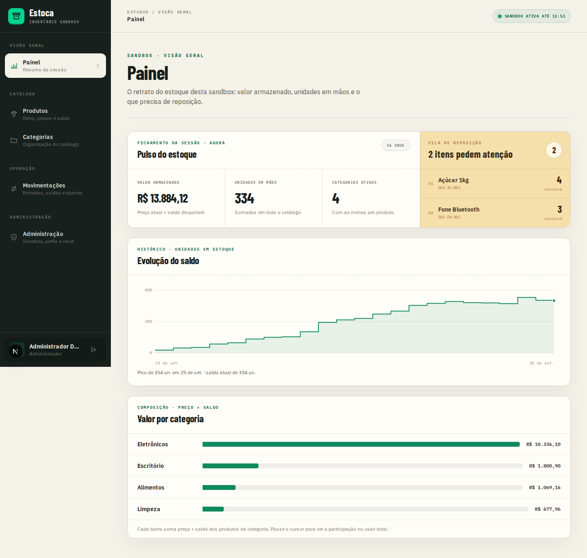
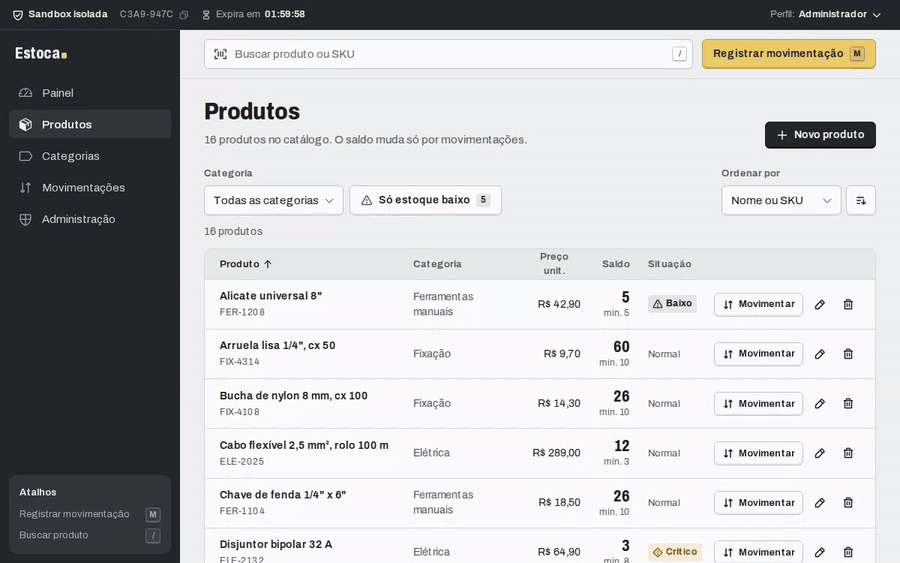
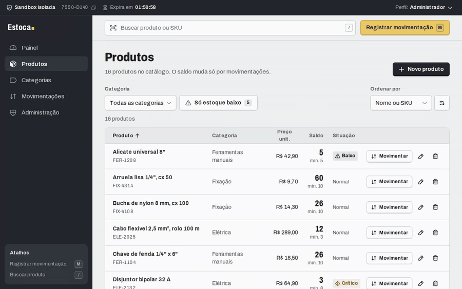
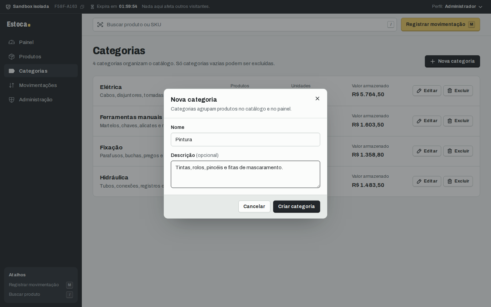
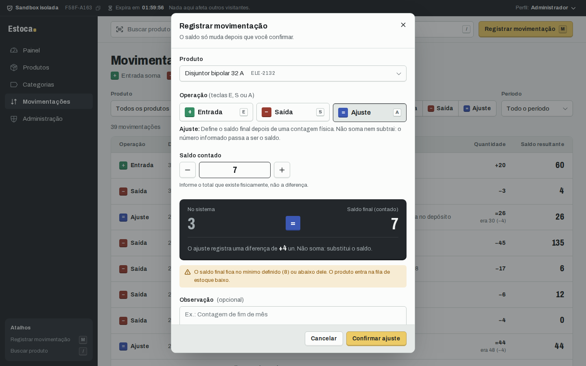
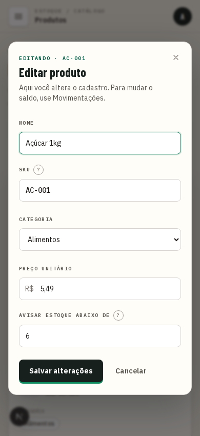
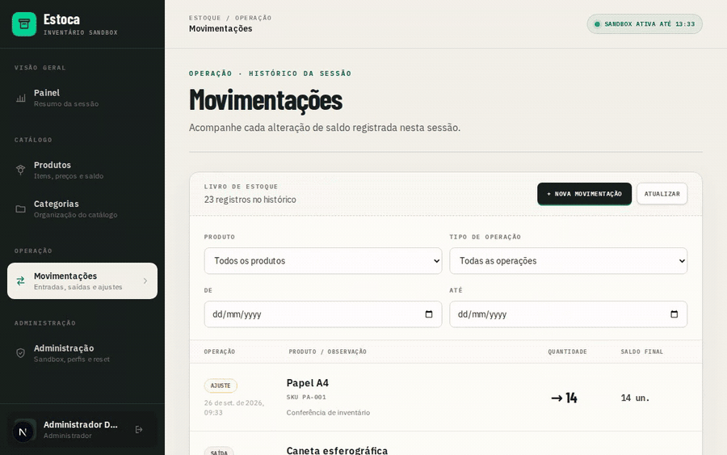
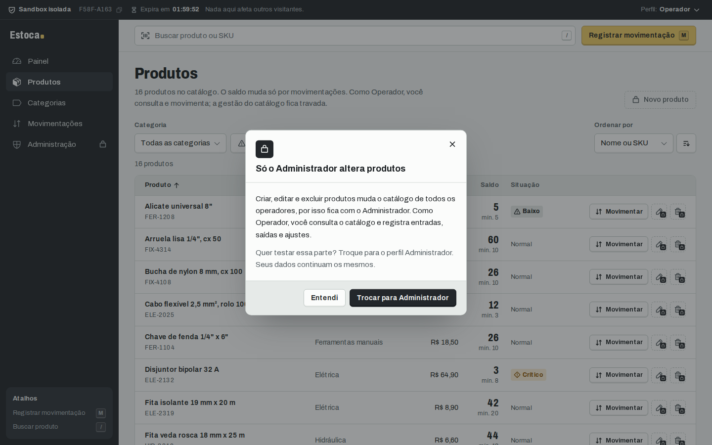
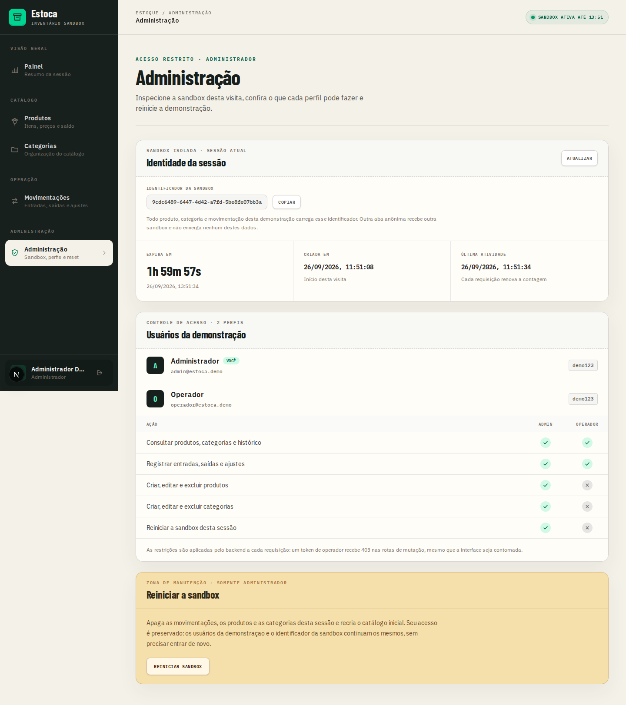

# Estoca

Mini ERP de estoque construído como projeto de portfólio. Cada visitante recebe
uma sandbox isolada para explorar produtos, categorias e movimentações sem ver
ou alterar dados de outra pessoa. Sessões expiram automaticamente e os dados
antigos são removidos por rotinas agendadas.

**Stack:** FastAPI · SQLAlchemy async · Alembic · PostgreSQL · Next.js ·
TypeScript · Tailwind CSS · Radix UI · Recharts · Docker

## Experimente em produção

- Frontend: https://estoca-erp.vercel.app
- API: https://estoca-api.onrender.com
- OpenAPI: https://estoca-api.onrender.com/docs
- Health check: https://estoca-api.onrender.com/healthz

O backend usa o plano gratuito do Render e pode levar cerca de um minuto para
responder à primeira requisição depois de um período sem tráfego.

As credenciais ficam preenchidas na interface:

| Perfil | Email | Senha | Acesso |
|---|---|---|---|
| Administrador | `admin@estoca.demo` | `demo123` | CRUD do catálogo e movimentações |
| Operador | `operador@estoca.demo` | `demo123` | Consulta e movimentações |

Cada nova sandbox já começa pronta para exploração: um depósito de material de
construção com 4 categorias, 16 produtos e 39 movimentações (o estoque inicial
de cada produto e mais 23 de exemplo). Há entradas, saídas, ajustes de
inventário e produtos abaixo do estoque mínimo. O administrador
pode restaurar esse estado inicial usando o reset da sessão.

## Telas

A interface segue a lógica de um coletor de dados de armazém. Uma barra de
status grafite mostra a sandbox, o prazo até ela expirar e o perfil em uso; o
campo de leitura busca produto, SKU ou categoria (atalho `/`), e a tecla amarela
registra uma movimentação de qualquer área (atalho `M`). O amarelo é reservado a
essa ação e às confirmações, e a cor de entrada, saída e ajuste fica só nos
sinais `+ − =`. O sistema visual completo está em
[`docs/DESIGN.md`](docs/DESIGN.md).

O painel reúne o valor armazenado, as unidades e as categorias ativas numa faixa
grafite, a fila de estoque baixo por urgência (zerado, crítico, baixo), o valor
por categoria e o saldo total em degrau, com um marcador por movimentação
(▲ entrada, ▼ saída, ◆ ajuste):



O catálogo ordena por qualquer coluna e filtra por categoria, por estoque baixo
ou pelo campo de leitura, tudo no cliente — o teto é de 50 produtos por sessão e
a lista já está em memória. Filtros e ordenação ficam na URL, então sobrevivem a
um recarregamento e podem ser compartilhados:



Todo formulário de escrita abre em **modal**, e não no topo da tabela. Cadastrar
um produto com quantidade inicial já registra a entrada no histórico:


O modal fecha pelo X, por Esc, por clique fora ou por Cancelar, o que não foi
salvo é descartado e o foco volta a quem abriu. Enquanto uma operação está em
andamento nada disso fecha o modal, e cliques ou Enter repetidos — inclusive
durante a animação de saída — enviam uma só requisição:


A exclusão diz quantas movimentações vão junto com o produto e só libera o botão
depois de uma confirmação explícita:



Categorias e movimentações seguem o mesmo padrão. No celular o modal vira uma
folha inferior: cabeçalho e ações ficam à vista e só o corpo rola:

| Categoria | Movimentação | Celular |
|---|---|---|
|  |  |  |

Entrada e saída somam ou retiram do saldo; **ajuste substitui** o saldo pelo
número informado, que é o que se usa depois de uma contagem física. As teclas E,
S e A trocam a operação, e o visor mostra o efeito antes de confirmar — no
ajuste, o saldo no sistema, o contado e a diferença:



O mesmo catálogo visto pelo operador. Os controles de cadastro continuam na
tela, marcados com cadeado, e o clique explica a restrição e oferece trocar de
perfil sem perder os dados — o backend responde 403 mesmo que a interface seja
contornada:



A área restrita mostra o prazo até a sandbox expirar, a identidade dela, as
credenciais de demonstração, o que cada perfil pode fazer e o reset:



As dezesseis capturas — com os modais de produto (cadastro, edição e exclusão),
categoria e movimentação, o bloqueio explicado ao operador e a versão para
celular — estão em
[`docs/screenshots/`](docs/screenshots/). Os seis GIFs, incluindo o do bloqueio
do operador, estão em [`docs/demos/`](docs/demos/). Ambos são gerados por
script, contra uma sandbox recém-criada, então não envelhecem em silêncio junto
com a interface.

## O que está pronto

- Sandbox isolada por visitante, com expiração e limpeza automática.
- Login com perfis de administrador e operador. O bloqueio fica visível na
  interface e é aplicado pelo backend a cada requisição.
- Interface "Coletor": barra de status com prazo e perfil, campo de leitura,
  atalhos de teclado (`M`, `/`, E/S/A) e uma rota por área.
- Painel com valor armazenado, fila de estoque baixo por urgência, valor por
  categoria e saldo total no tempo, com a operação marcada em cada ponto.
- CRUD de produtos e categorias, com busca, ordenação por coluna e filtros por
  categoria e por estoque baixo, guardados na URL.
- Entrada, saída e ajuste absoluto de estoque, com histórico paginado e filtros
  por produto, tipo de operação e período.
- Cadastro, edição, exclusão e movimentação em modais acessíveis: foco preso e
  devolvido, Esc, X e clique fora, rascunho descartado ao fechar e proteção
  contra envio duplicado.
- Troca de perfil sem sair da sandbox, e a sessão expirada avisada a tempo, com
  a contagem regressiva renovada a cada ação.
- Área de administração com identidade da sandbox, matriz de permissões por
  perfil e reset da sessão sem deslogar.
- Catálogo inicial realista com 16 produtos e 39 movimentações distribuídas ao
  longo de 14 dias.
- Bloqueio de saída sem saldo e atualização atômica do produto e do histórico.
- Interface responsiva validada em produção no Chrome e no WebKit em viewport
  de iPhone.

## Arquitetura

O monorepo separa a API em `backend/` e a aplicação web em `frontend/`:

```text
Navegador
  └─ sessionStorage + cookie/header X-Session-Id
       └─ Next.js
            └─ FastAPI: routers → services → repositories
                 └─ PostgreSQL: entidades filtradas por session_id
```

No backend, routers tratam HTTP, services concentram regras de negócio e
repositories são a única camada que acessa o banco. O frontend centraliza os
contratos HTTP em `lib/api.ts`, e uma store (`lib/estoca/store.tsx`) concentra
sessão, login, catálogo e o relógio da sandbox; as telas leem dela e de
consultas próprias para o histórico.

### Decisões que sustentam o projeto

- **Isolamento por sessão:** toda tabela de negócio possui `session_id`, e toda
  leitura ou escrita é limitada à sessão resolvida na requisição.
- **Saldo coerente:** somente `stock_movement_service` altera
  `product.quantity`; saldo e histórico são persistidos na mesma transação.
- **Semântica explícita:** entrada e saída recebem deltas positivos; ajuste
  recebe o saldo final absoluto. Toda movimentação registra o saldo anterior
  (`previous_quantity`) e o resultante (`resulting_quantity`).
- **Fallback entre domínios:** o frontend envia cookie e `X-Session-Id`, porque
  Vercel e Render estão em domínios diferentes e cookies de terceiros podem ser
  recusados.
- **Dinheiro sem ponto flutuante:** preços usam `Numeric(10,2)` no banco e
  `Decimal` no backend.
- **Limpeza por cascade:** os jobs removem sessões; o PostgreSQL apaga os dados
  relacionados por `ON DELETE CASCADE`.
- **Histórico com linha do tempo real:** o seed dá a cada movimentação um dia e
  uma hora dos últimos 14 dias. O seed roda em uma transação e `created_at` usa
  `server_default=func.now()`, que no PostgreSQL é o horário da *transação* —
  sem essa retrodatação, todas nasceriam com o mesmo carimbo e nem a série
  histórica nem o filtro por período teriam o que mostrar.
- **Commit antes da resposta:** a sessão do banco é uma dependência com escopo
  `function`, então o commit acontece antes de a resposta sair. No escopo padrão
  do FastAPI ele viria depois, e um cliente que encadeia chamadas — criar a
  sandbox e logo ler o prazo, registrar e logo reler o histórico — leria o
  estado de antes.
- **Agregação no banco:** a série de saldo sai de uma consulta só. Cada
  movimentação guarda o saldo do produto antes e depois de aplicar, então o
  delta do evento vem da própria linha e a soma corrente reconstrói o total.
  Cada ponto também traz a operação e o produto, para o gráfico marcar
  entradas, saídas e ajustes.
- **Série em degrau:** o saldo muda no evento e se mantém até o próximo, então o
  gráfico (Recharts) usa degraus — interpolar afirmaria uma variação contínua
  que não aconteceu. A cor da operação fica só no marcador, que também muda de
  forma, para não depender só da cor.

O modelo de dados, os endpoints e os detalhes das camadas estão em
[`docs/ARCHITECTURE.md`](docs/ARCHITECTURE.md). A configuração dos ambientes
publicados está em [`docs/DEPLOYMENT.md`](docs/DEPLOYMENT.md).

## Desenvolvimento local

### Backend e PostgreSQL

Com Docker e Docker Compose instalados:

```bash
docker compose up --build
docker compose run --rm backend alembic upgrade head
```

A API fica em `http://localhost:8000` e o Postgres é exposto na porta `5433`.
O Compose também cria o banco `estoca_test` usado pela suíte de integração.

Para trabalhar diretamente no host, o backend usa Python 3.12 e Poetry 2.4:

```bash
cd backend
poetry sync --with dev
poetry run alembic upgrade head
poetry run uvicorn app.main:app --reload
```

### Frontend

O frontend requer Node.js 20.9 ou mais recente:

```bash
cd frontend
cp .env.example .env.local
npm ci
npm run dev
```

No PowerShell, use `Copy-Item .env.example .env.local` no lugar de `cp`. A
interface fica em `http://localhost:3000`. Para usar a API local, defina
`NEXT_PUBLIC_API_URL=http://localhost:8000` no `.env.local`.

## Verificações

Backend:

```bash
docker compose run --rm backend pytest
docker compose run --rm backend ruff check .
docker compose run --rm backend ruff format --check .
```

Frontend:

```bash
cd frontend
npm run lint
npm run build
npx playwright install webkit
npm run test:e2e:webkit
```

Os modais de produto, categoria e movimentação têm testes próprios em Chromium,
contra o frontend local (com backend e frontend rodando):

```bash
npx playwright install chromium
PLAYWRIGHT_BASE_URL=http://localhost:3000 npm run test:e2e:modais
```

O teste WebKit roda contra a produção por padrão, remove os cookies e confirma
que bootstrap após recarga, login e movimentação preservam a mesma sandbox pelo
header `X-Session-Id`. Para rodá-lo localmente, aponte também a API:
`PLAYWRIGHT_BASE_URL=http://localhost:3000 PLAYWRIGHT_API_URL=http://localhost:8000`.

As capturas da documentação também são geradas por script, contra uma sandbox
recém-criada, então refletem sempre o mesmo catálogo inicial:

```bash
cd frontend
npm run screenshots                      # imagens de docs/screenshots/
npm run demos                            # GIFs de docs/demos/
npm run demos -- produto-cadastro-em-modal   # só o GIF indicado
BASE_URL=http://localhost:3000 npm run screenshots
```

O script de capturas apaga as imagens numeradas anteriores antes de gravar, para
que uma renumeração não deixe arquivos órfãos. Os GIFs pedem o `ffmpeg`
(`sudo apt install ffmpeg` no Ubuntu/WSL) e o Chromium do Playwright com as
bibliotecas do sistema (`sudo npx playwright install-deps chromium`).

Os GIFs usam o Playwright para gravar a interação e o `ffmpeg` para converter.
GIF, e não vídeo, porque é o único formato que o GitHub anima inline a partir de
um arquivo do próprio repositório: um `.mp4` commitado e referenciado com
sintaxe de imagem não toca.

## Hospedagem e automações

O ambiente foi desenhado para custar **US$ 0/mês e não exigir cartão de
crédito**:

- Vercel hospeda o frontend.
- Render executa a API em container Docker na região de Oregon.
- Neon fornece o PostgreSQL também em Oregon, evitando tráfego inter-regional
  entre a API e o banco.
- GitHub Actions executa CI e as rotinas de limpeza.

Um workflow remove sessões expiradas a cada hora; outro reinicia todas as
sandboxes diariamente. Ambos autenticam as chamadas internas com
`X-Cron-Secret` e repetem a requisição para tolerar o cold start do Render.

## Próximos passos

- Fornecedores e clientes.
- Múltiplos depósitos.
- Refresh token e rate limit para criação de sessões.
- Ampliar os testes E2E para o CRUD completo e outros tamanhos de tela.
- Exportação do histórico em CSV.

O histórico do projeto e os critérios de cada etapa estão em
[`docs/ROADMAP.md`](docs/ROADMAP.md).
